# 非遗文化互动平台 · 前端服务

本项目为“非物质文化遗产传播与互动平台”的前端部分，基于 Vue 2 构建，使用 Element Plus 作为 UI 组件库，Pinia 作为状态管理。前端通过 RESTful API 调用后端接口，实现用户注册登录、非遗知识问答、评论点赞、排行榜、AI智能问答等功能。

🌐 后端项目地址  
后端代码仓库（基于 Spring Boot + MyBatis + MySQL + Redis）已开源，详见：

👉 [非遗互动平台后端仓库](https://github.com/lzw0514/FeiyiHouduan.git)

页面展示与操作指南请参考本仓库的 README.md 文件。

## 📌 项目简介  

🎯 项目目标：弘扬中国非遗文化，借助大模型实现知识互动，提升用户参与度。  
📚 技术栈：Vue 2 + Element Plus + Pinia + Axios  
🧠 项目特色：
- 现代化响应式界面，友好的用户体验
- 集成后端服务，支持用户注册、登录、非遗问答、评论、点赞等功能
- 基于 Vue 2，前后端分离，易于扩展和维护

## 🎨 页面展示

### 🏠 首页


---


---


---
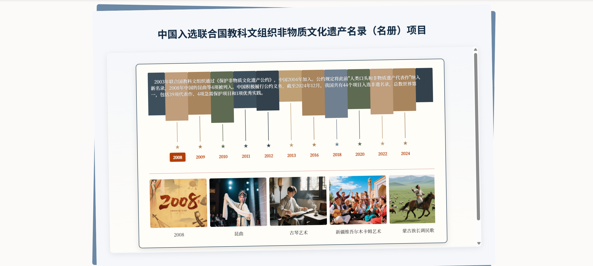

---
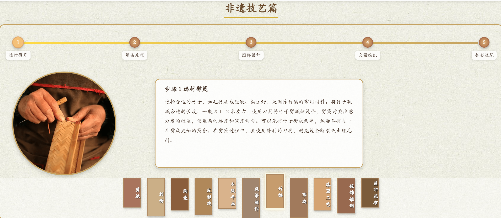

---
### 🏠 登录
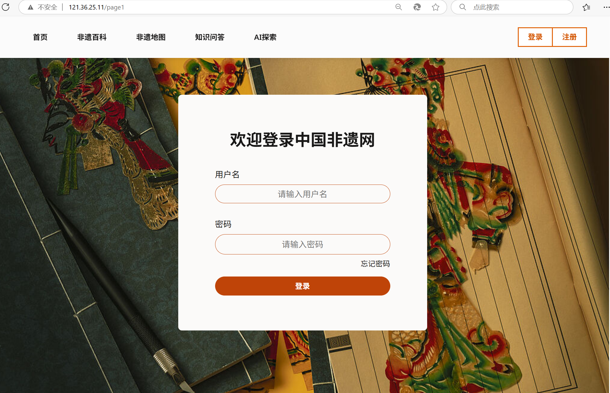

---
### 🏠 注册
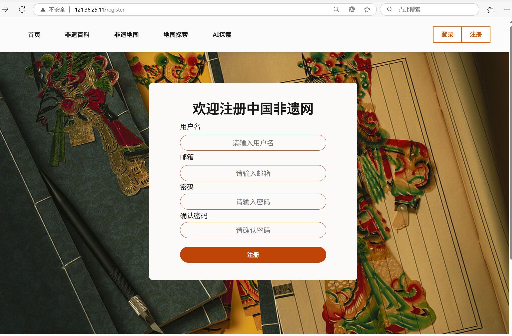

---
### 💬 非遗问答
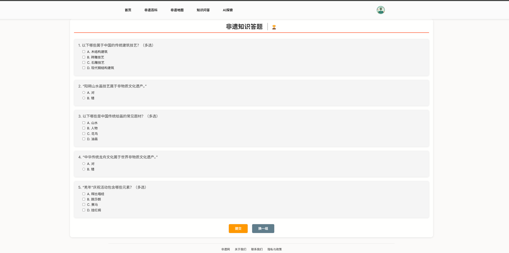

---

### 🏆 排行榜
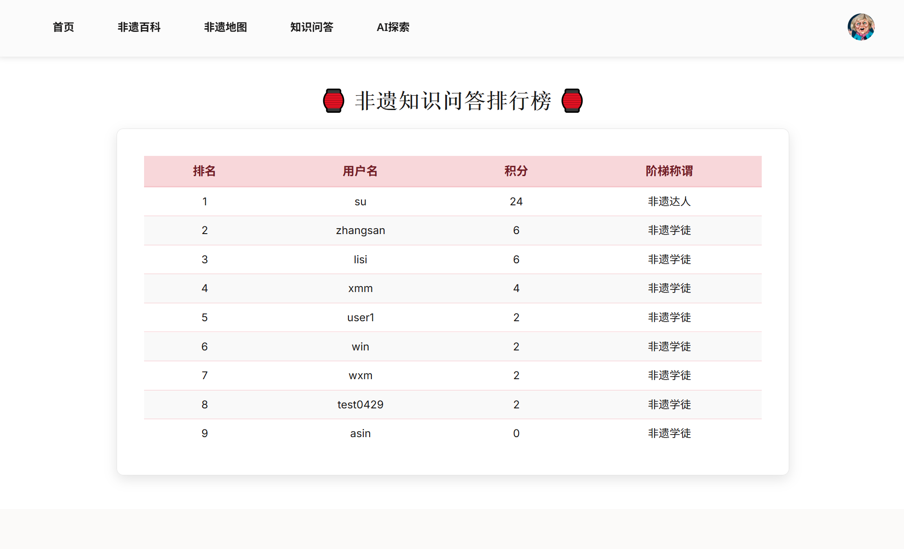

---

### 📚 非遗列表
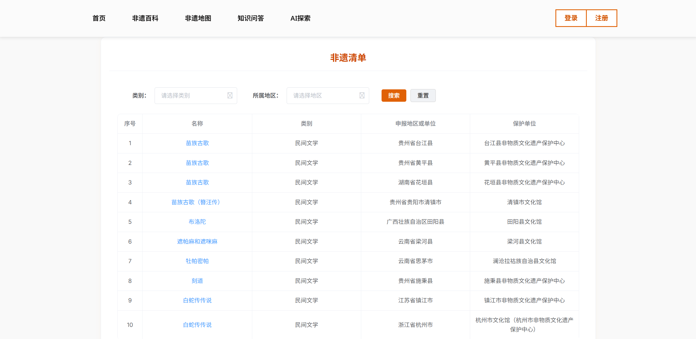

---

### 📚 非遗详情
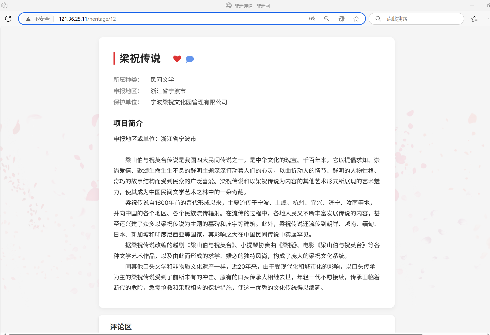

---

### 🤖 AI 问答
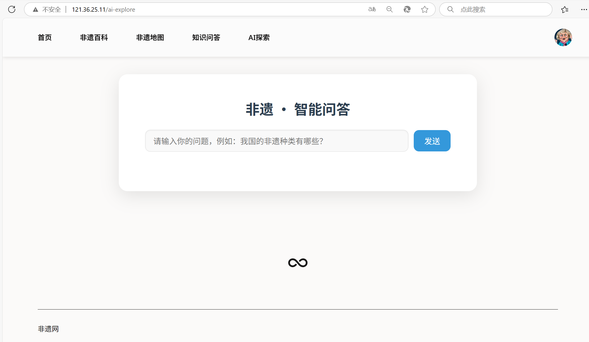

---

### 📍 非遗地图可视化
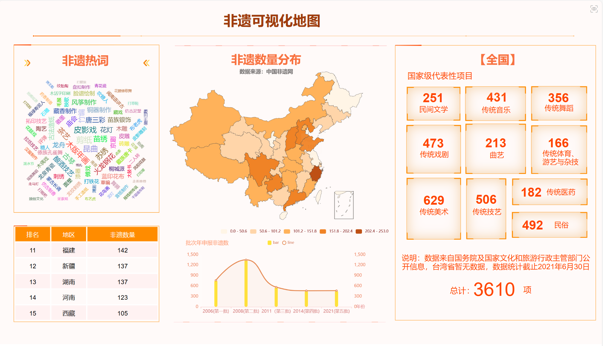

---

### 🙋‍♀️个人主页
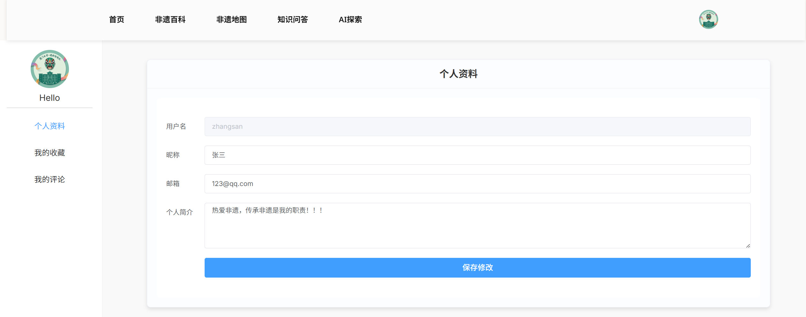

---

### 🙋‍♀️个人评论
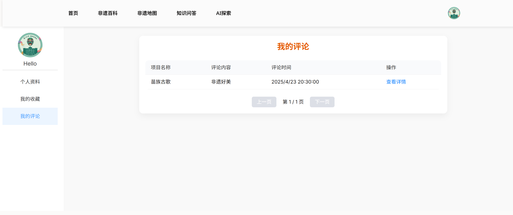

---

### 🙋‍♀️个人收藏
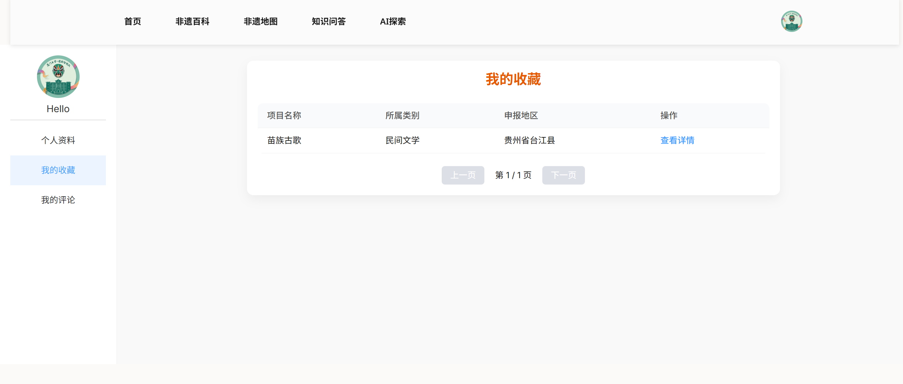


##🏗️ 项目结构

```

feiyi-vue/
├── .idea/                  # IntelliJ IDEA项目配置目录
├── dist/                   # 构建后的生产文件目录
├── locales/                # 国际化语言文件
├── node_modules/           # 项目依赖库（npm安装的包）
├── public/                 # 静态资源目录（不会被webpack处理）
│   ├── HTML                # 非遗地图可视化文件
│   ├── images/             # 图片资源
│   └── index.html          # html文件
├── src/                    # 项目源代码目录
│   ├── api/                # API请求相关代码
│   ├── components/         # Vue组件
│   ├── images/             # 图片资源
│   ├── stores/             # 状态管理（如token/userInfo）
│   ├── utils/              # 工具函数
│   ├── views/              # 页面级组件
│   ├── App.vue             # 根组件
│   ├── main.js             # 项目入口文件
│   ├── router.js           # 路由配置
│   └── style.css           # 全局样式
├── package.json            # 项目配置和依赖声明
└── External Libraries/     # IDE的外部库引用

```
## ⚙️ 环境依赖

- Node.js 14.x+
- npm 6.x+
- Vue 2.x+
- Element Plus 2.x+
- Pinia 2.x+

## 🚀 快速启动

1. 克隆项目：
   ```bash
   git clone https://github.com/lzw0514/FeiyiQianduan.git

2. 安装依赖：

   ```bash
   cd feiyi-frontend
   npm install
   
3. 启动项目：
   ```bash
   npm run serve

  访问 http://localhost:8081 查看项目。

##  📫 常用接口说明

| 接口路径                     | 方法   | 描述       |
| ------------------------ | ---- | --------------  |
| `/user/register`         | POST | 用户注册         |
| `/user/login`            | POST | 用户登录         |
| `/api/qwen/chat`         | POST | AI 问答接口      |
| `/comment/add`           | POST | 添加评论         |
| `/user/favorite/add`     | POST | 点赞或取消点赞    |
| `/user/top10`            | GET  | 查询排行榜       |
| `/user/info`             | GET  | 获取当前用户信息 |
| `/heritage/list`         | GET  | 获取所有非遗信息 |
| `/heritage/details/{id}` | GET  | 获取详细非遗信息 |


🙋‍♀️ 项目背景
本项目由厦门大学学生独立设计开发，用于参与 2025 全国大学生计算机设计大赛。项目旨在通过数字化手段与人工智能，推动中国非物质文化遗产的传播与教育普及。

## 📄 License
MIT License © 2025 by 刘智文

MIT License © 2025 by 王晓敏
